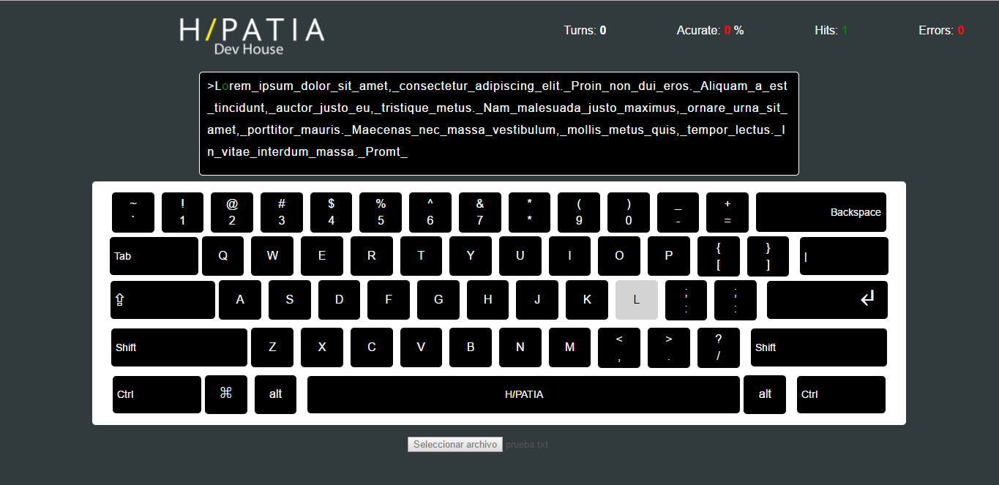
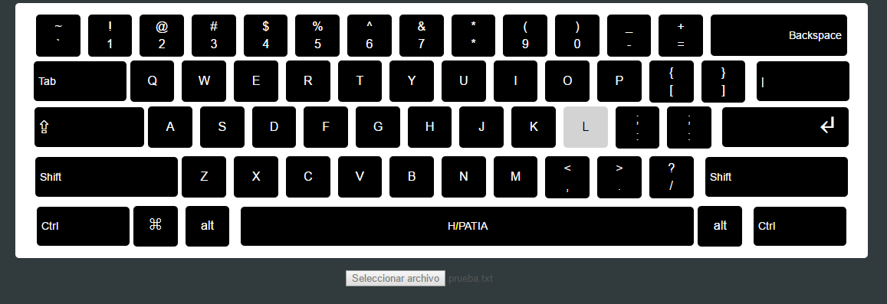
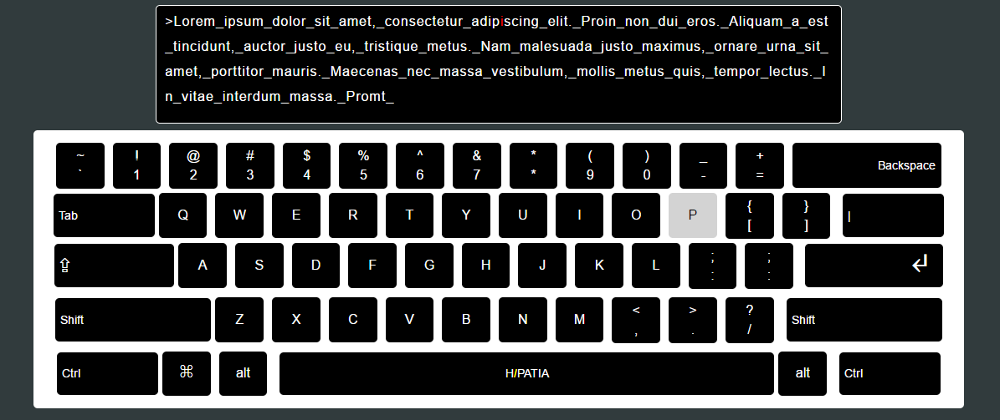
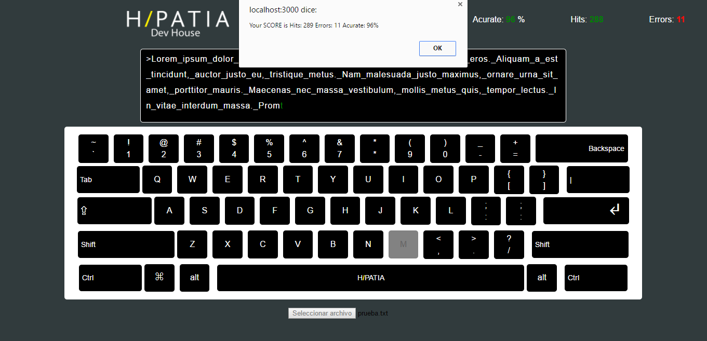

# React Keyboard

#### **We made a keybr in react for the students of Hipatia Dev House praticing your keyboard typing everyday.**

Where all students will be able to upload text files to practice their typing skills every day.

### **The Keyboard was made it with components.**

We will continue to work with constant upgrades and system performance improvements.

### **IN ACTION**

##### **1.-** You need to load a text file.

##### **2.-** When the app load your file he printed the text in your file.

##### **3.-** When you press the key on focus and is correct is colored in green at the same time the keyboard active the key, otherwise the character is colored in red and the keyboard don't push the key.

##### **4.-** When the end of your life ends all the characters, the scoreboard will show you a message on the screen with your final score and you can repeat the exercises as many times as you wish.

                               PRACTICE YOUR SKILLS AND CODE THE WEB
